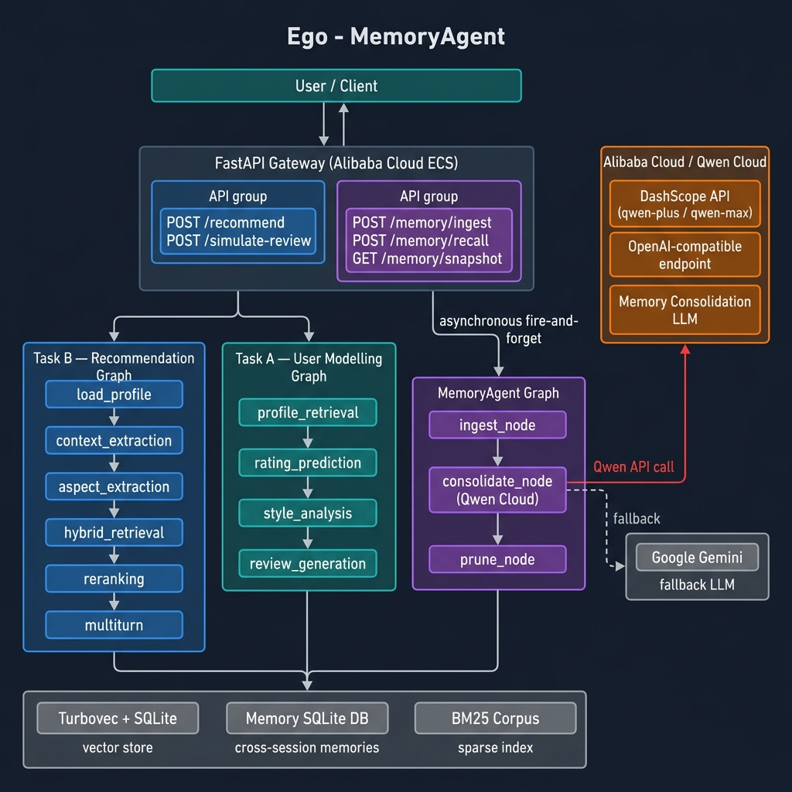

# Ego — MemoryAgent for Nigerian E-Commerce

> **Global AI Hackathon with Qwen Cloud · Track 1: MemoryAgent**
>
> An agentic recommendation engine with persistent cross-session memory, powered by **Qwen Cloud (Alibaba Cloud DashScope)** and LangGraph.

[](LICENSE)
[](https://www.python.org/)
[](https://github.com/langchain-ai/langgraph)

---

## Overview

**Ego** is a dual-task recommendation system for Nigerian e-commerce that now features a **MemoryAgent** — a persistent, cross-session memory layer that:

- **Autonomously accumulates experience** from every user interaction
- **Remembers user preferences** across sessions using Ebbinghaus-style decay weighting
- **Makes increasingly accurate decisions** by injecting recalled memories into each new recommendation pass
- **Forgets outdated information** via time-based importance decay and proactive pruning
- **Fits critical memories into limited context windows** via token-budget-aware ranked recall

The system is grounded in real Jumia product reviews scraped from the Nigerian market, and uses **Qwen Cloud (DashScope)** as the primary LLM for memory consolidation, with Google Gemini as a transparent fallback.

---

## Architecture



### System components

```
                    ┌─────────────────────────────────────────────────────┐
                    │             FastAPI Gateway (Alibaba Cloud ECS)      │
                    │  /recommend  /simulate-review                        │
                    │  /memory/ingest  /memory/recall  /memory/snapshot   │
                    └──────┬─────────────────┬──────────────┬─────────────┘
                           │                 │              │ async fire-and-forget
                    Task B Graph      Task A Graph    MemoryAgent Graph
                    (Recommend)      (User Model)    (Persistent Memory)
                           │                 │              │
              ┌────────────┘      ┌──────────┘    ┌─────────┘
              ▼                   ▼               ▼
         Turbovec           Turbovec +       Memory SQLite DB
         Vector Store       Naija Examples   (cross-session)
              │                   │               │
              └────────────┬──────┘      Qwen Cloud (DashScope)
                           │             consolidation LLM
                     BM25 Corpus
```

### MemoryAgent Graph (Track 1 focus)

```
ingest_node
    │   Persists new interaction events to SQLite
    ▼
consolidate_node
    │   Qwen-powered: merges duplicates, promotes preferences,
    │   writes a rolling long-term summary (≤300 words)
    ▼
prune_node
    │   Ebbinghaus decay prune + hard-cap eviction
    ▼
  END
```

### Task B — Recommendation Graph

| Node | Purpose |
|---|---|
| `load_profile_node` | Load user profile; detect cold-start |
| `context_extraction_node` | Parse request into structured signals (Qwen/Gemini) |
| `aspect_extraction_node` | Extract product aspects + BM25 keywords |
| `cold_start_node` | Proxy embedding from nearest user cluster |
| `hybrid_retrieval_node` | Dense ANN + CF + BM25 fused via RRF |
| `reranking_node` | Blended local scorer → Qwen/Gemini reason generation |
| `multiturn_node` | Conversational refinement + blended re-retrieval |

### Task A — User Modelling Graph

| Node | Purpose |
|---|---|
| `profile_retrieval_node` | Load history; rank per-aspect exemplars via cosine |
| `rating_prediction_node` | Similarity-weighted rating prediction |
| `style_analysis_node` | Statistical style profile (no LLM) |
| `review_generation_node` | Single Qwen/Gemini call: review + Naija voice fused |

---

## MemoryAgent Design

### Memory Storage

Every interaction writes to a SQLite database at `scratch/cache/memory.db`:

| Field | Description |
|---|---|
| `content` | The memory text |
| `memory_type` | `preference` \| `interaction` \| `feedback` \| `context` |
| `importance` | Float `[0, 1]` — initial salience, boosted on recall |
| `access_count` | Times recalled — increases decay resistance |
| `created_at` | ISO timestamp |
| `last_accessed` | ISO timestamp — drives decay calculation |
| `session_id` | Origin session for provenance |

### Forgetting Curve

Importance decays exponentially using an Ebbinghaus-inspired formula countered by access frequency:

```
R(t) = importance × exp(-(t / half_life) / sqrt(1 + access_count))
```

- `half_life = 7 days` — a memory at importance 0.5 that is never recalled will drop below the `0.05` prune threshold in ~37 days
- Each recall boosts `importance` by `+0.08` and resets the clock
- Hard cap of **200 memories per user** with lowest-importance eviction

### Context-Window-Aware Recall

`MemoryStore.recall()` accepts a `max_tokens` budget and returns the highest-scoring memories that fit:

```python
from core.memory import MemoryStore

store = MemoryStore("user_042")
memories = store.recall(query="wireless earbuds for gym", max_results=10, max_tokens=600)
```

Ranking uses `effective_importance × (1 + 0.5 × keyword_overlap)` so both recency-weighted importance and query relevance drive selection.

### Qwen Consolidation (Alibaba Cloud)

The `consolidate_node` uses **Qwen Plus** (via DashScope OpenAI-compatible endpoint) to:

1. Read up to 80 most important memories
2. Write a 300-word long-term user summary
3. Extract named preference key-value pairs (`budget`, `top_category`, etc.)
4. Store both in `memory_summaries` and `user_preferences` tables

```python
# agents/memory_agent.py — _get_qwen_llm()
from langchain_openai import ChatOpenAI

llm = ChatOpenAI(
    model="qwen-plus",
    api_key=DASHSCOPE_API_KEY,
    base_url="https://dashscope-intl.aliyuncs.com/compatible-mode/v1",
)
```

---

## Technical Stack

| Component | Technology |
|---|---|
| Agent framework | [LangGraph](https://github.com/langchain-ai/langgraph) |
| Primary LLM | **Qwen Plus** (Alibaba Cloud DashScope) |
| Fallback LLM | Google Gemini (`gemini-flash-latest`) |
| Embeddings | `all-MiniLM-L6-v2` via SentenceTransformers |
| Vector store | [Turbovec](https://pypi.org/project/turbovec/) |
| Memory store | SQLite (`scratch/cache/memory.db`) |
| Sparse retrieval | BM25 via `rank-bm25` |
| Cross-encoder | `cross-encoder/ms-marco-MiniLM-L-6-v2` |
| API | FastAPI + Uvicorn |
| LLM response cache | SQLite (`langchain_community.cache.SQLiteCache`) |
| Embedding cache | `diskcache` (persistent, disk-backed) |
| Cloud | **Alibaba Cloud ECS + Container Registry** |

---

## Alibaba Cloud Deployment

### Proof of Deployment

See [`alibaba_cloud_proof.py`](alibaba_cloud_proof.py) — a runnable script that:

1. Connects to the DashScope OpenAI-compatible endpoint
2. Invokes the `qwen-plus` model
3. Prints a verified response confirming Alibaba Cloud connectivity

```bash
export DASHSCOPE_API_KEY=sk-...
python alibaba_cloud_proof.py
```

Expected output:
```
=== Ego — Alibaba Cloud / Qwen Proof of Deployment ===
  Connecting to DashScope: https://dashscope-intl.aliyuncs.com/compatible-mode/v1
  Model: qwen-plus
✓ DashScope API reachable
✓ Qwen model: qwen-plus
✓ Response: I am Qwen, running on Alibaba Cloud.
```

### Deployment topology

```
Alibaba Cloud ECS
  └─ Docker Compose / ACK
       ├─ ego-api  (FastAPI + MemoryAgent)
       └─ ego-frontend  (React/Vite)

Alibaba Cloud Container Registry (ACR)
  └─ registry.cn-shanghai.aliyuncs.com/ego/ego-api:latest

DashScope (Alibaba Cloud AI)
  └─ qwen-plus (memory consolidation)
  └─ qwen-max  (optional upgrade)
```

---

## Getting Started

### Prerequisites

- Docker and Docker Compose
- A [DashScope API key](https://dashscope.aliyuncs.com/) (Qwen Cloud / Alibaba Cloud)
- A Google AI Studio API key (optional fallback)

### 1. Configure environment

```bash
cp .env.example .env
```

Edit `.env`:

```dotenv
# Alibaba Cloud / Qwen Cloud (primary LLM for MemoryAgent consolidation)
DASHSCOPE_API_KEY=sk-your-dashscope-key
QWEN_MODEL=qwen-plus                    # or qwen-max, qwen-turbo

# Google Gemini (fallback — used if DASHSCOPE_API_KEY is not set)
GOOGLE_API_KEY=your_google_api_key_here
LLM_MODEL=gemini-flash-latest

EMBEDDING_MODEL=all-MiniLM-L6-v2
DATASET_BASE_URL=https://huggingface.co/datasets/DreamerX/Ego-Jumia-Review/resolve/main
```

### 2. Build and start

```bash
make up
```

### 3. Run the data pipeline

```bash
make index
```

### 4. Verify

```bash
curl http://localhost:8000/health
# {"status": "ok"}
```

---

## API Reference

### `POST /api/recommend`

Returns personalised product recommendations. Automatically persists the interaction to the MemoryAgent (async, non-blocking).

```json
{
  "user_id": "user_042",
  "context": "I need wireless earbuds for the gym",
  "n": 5,
  "persona_description": "budget-conscious tech lover",
  "session_history": [],
  "domain_filter": "electronics"
}
```

---

### `POST /api/simulate-review`

Simulates how a user would rate and review a product.

```json
{
  "user_id": "user_042",
  "item": {
    "name": "Infinix Hot 40 Pro",
    "category": "Smartphones",
    "description": "6.78-inch display, 108MP camera"
  }
}
```

---

### MemoryAgent Endpoints

#### `POST /api/memory/ingest`

Persist interaction events and run Qwen consolidation.

```json
{
  "user_id": "user_042",
  "session_id": "sess_abc123",
  "events": [
    {
      "type": "preference",
      "content": "User prefers budget earbuds under ₦20,000",
      "importance": 0.8
    },
    {
      "type": "feedback",
      "content": "User rated JBL Tune 4.5/5 and purchased it",
      "importance": 0.9,
      "metadata": {"item_id": "jbl_tune_230nc"}
    }
  ],
  "run_consolidation": true
}
```

Response:
```json
{
  "user_id": "user_042",
  "memories_before": 12,
  "memories_after": 14,
  "pruned": 0,
  "evicted": 0,
  "summary_updated": true
}
```

#### `POST /api/memory/recall`

Retrieve relevant memories within a token budget.

```json
{
  "user_id": "user_042",
  "query": "wireless earbuds for gym",
  "max_results": 10,
  "max_tokens": 600
}
```

Response:
```json
{
  "user_id": "user_042",
  "summary": "Budget-conscious electronics shopper who prefers Infinix and JBL...",
  "preferences": {"budget": "low", "top_category": "electronics"},
  "recent_memories": [
    {
      "content": "User prefers budget earbuds under ₦20,000",
      "type": "preference",
      "score": 0.89
    }
  ]
}
```

#### `GET /api/memory/snapshot/{user_id}`

Lightweight memory status check.

```json
{
  "user_id": "user_042",
  "memory_count": 14,
  "preferences": {"budget": "low", "top_category": "electronics"},
  "summary": "Budget-conscious electronics shopper..."
}
```

---

## Environment Variables

| Variable | Default | Description |
|---|---|---|
| `DASHSCOPE_API_KEY` | *(optional)* | Alibaba Cloud DashScope key for Qwen |
| `QWEN_MODEL` | `qwen-plus` | Qwen model name |
| `GOOGLE_API_KEY` | *(optional)* | Google Gemini fallback key |
| `LLM_MODEL` | `gemini-flash-latest` | Gemini model name (fallback) |
| `EMBEDDING_MODEL` | `all-MiniLM-L6-v2` | SentenceTransformer model |
| `DATASET_BASE_URL` | *(see `.env.example`)* | Dataset download base URL |

---

## Project Structure

```
Ego/
├── agents/
│   ├── memory_agent.py     # MemoryAgent LangGraph graph (Track 1 core)
│   ├── rerank_agent.py     # Two-stage reranker
│   └── retrieval_agent.py  # Hybrid retrieval: Dense + CF + BM25
│
├── core/
│   ├── memory.py           # MemoryStore: SQLite + decay + recall
│   ├── config.py           # Settings: Qwen + Gemini + storage
│   ├── llm.py              # Gemini singleton with SQLite cache
│   ├── embeddings.py       # SentenceTransformer + diskcache
│   ├── vector_store.py     # Turbovec wrapper
│   ├── hybrid_search.py    # BM25 + RRF
│   ├── cross_encoder.py    # Cross-encoder scoring
│   └── ...
│
├── graphs/
│   ├── task_a.py           # User Modelling LangGraph pipeline
│   └── task_b.py           # Recommendation LangGraph pipeline
│
├── api/
│   ├── main.py             # FastAPI app + memory endpoints
│   └── schemas.py          # Pydantic request/response models
│
├── docs/
│   └── architecture.png    # System architecture diagram
│
├── alibaba_cloud_proof.py  # Proof of Alibaba Cloud deployment
├── LICENSE                 # MIT License
├── Dockerfile              # Multi-stage Docker build
├── docker-compose.yml      # Services: api, frontend, indexer
├── requirements.txt        # Python dependencies (incl. openai, dashscope)
└── Makefile                # Developer workflow shortcuts
```

---

## Key Design Decisions

### Why Qwen for Memory Consolidation?

Qwen Plus excels at structured JSON extraction and concise summarisation — both critical for producing compact, accurate user preference summaries from noisy interaction logs. Its DashScope endpoint is OpenAI-compatible, making integration seamless via `langchain-openai`.

### Ebbinghaus Forgetting + Access Boosting

Rather than simple TTL expiry, memories decay continuously based on:
- **Time since last access** — decays half-life every 7 days
- **Access frequency** — each recall slows future decay via `sqrt(1 + access_count)`
- **Minimum threshold** — entries below `0.05` effective importance are pruned on next save

This ensures the agent **remembers frequently-relevant preferences** and **forgets one-off interactions** without manual cleanup.

### Context-Window Budget

`recall()` accepts `max_tokens` and greedily selects highest-scoring memories within the character budget (`max_tokens × 4`), guaranteeing the injected memory block never overflows any downstream LLM context window.

### Async Memory Persistence

Memory ingestion after `/recommend` runs as `asyncio.ensure_future()` — the recommendation response returns immediately while the MemoryAgent graph runs in the background. Users never wait for memory writes.

---

## Development

```bash
make help          # Show all targets
make up            # Start all services
make index         # Run data pipeline
make test          # Run pytest
make lint          # Ruff linter
```

### Running locally (without Docker)

```bash
python -m venv .venv && source .venv/bin/activate
pip install -r requirements.txt
uvicorn api.main:app --reload --port 8000
```

---

## Evaluation

```bash
# Task A (user modelling)
PYTHONPATH=. python scripts/evaluate.py --task a --limit 20

# Task B (recommendations)
PYTHONPATH=. python scripts/evaluate.py --task b --limit 20
```

| Metric | Target | Task |
|---|---|---|
| ROUGE-L | ≥ 0.35 | Task A (review generation) |
| BERTScore F1 | ≥ 0.82 | Task A (review generation) |
| RMSE | ≤ 0.80 | Task A (rating prediction) |
| NDCG@10 | ≥ 0.15 | Task B (recommendation ranking) |

---

## License

[MIT](LICENSE) — see LICENSE file for details.
