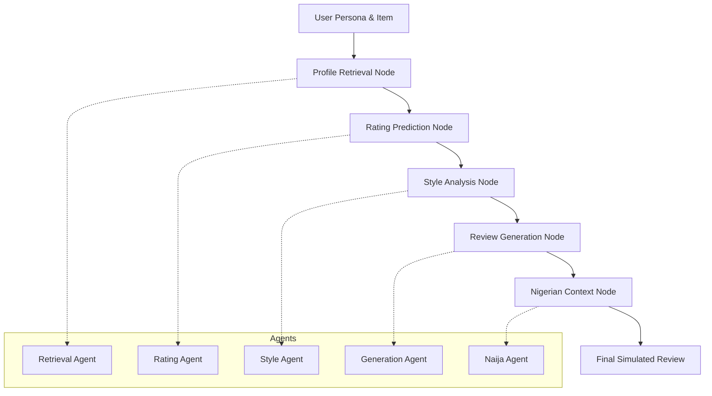

# Ego: Nigerian E-commerce User Modelling Agent

Ego is a sophisticated agentic framework designed to simulate user behavior and generate culturally authentic product reviews for the Nigerian e-commerce market (specifically targeting Jumia Nigeria).

Built with **LangGraph**, **Google Gemini**, and **Qdrant**, Ego achieves high accuracy in rating prediction and linguistic style transfer, capturing the unique "Naija" voice.

## 🚀 Key Features

- **Agentic Workflow**: Modular LangGraph pipeline for user profiling, rating prediction, and review generation.
- **Cultural Intelligence**: A dedicated `NaijaAgent` that uses RAG-based style transfer to inject authentic Nigerian Pidgin and cultural nuances.
- **Hybrid Recommendation**: Combines semantic search with collaborative filtering signals for accurate item recommendations.
- **Persistence**: High-performance vector storage using Qdrant for user profiles and voice samples.

## 🏗️ Architecture

The system is designed with a modular approach, separating the agentic logic (LangGraph) from the individual agent capabilities.



### Modular Design
Each stage of the pipeline is handled by a specialized agent:
- **`RetrievalAgent`**: Fetches user profiles and finds the most relevant historical examples from Qdrant.
- **`RatingAgent`**: Predicts product ratings (1-5) using a weighted similarity algorithm.
- **`StyleAgent`**: Analyzes the user's historical writing patterns (tone, length, vocabulary).
- **`GenerationAgent`**: Synthesizes a new review based on the item, rating, and style profile.
- **`NaijaAgent`**: Refines the generated text to match the authentic Nigerian customer voice.

## 🛠️ Getting Started

### Prerequisites
- Python 3.10+
- Qdrant (Local or Cloud)
- Google Gemini API Key

### Installation
1. Clone the repository:
   ```bash
   git clone https://github.com/your-repo/ego.git
   cd ego
   ```
2. Install dependencies:
   ```bash
   pip install -r requirements.txt
   ```
3. Configure environment:
   Create a `.env` file with:
   ```env
   GEMINI_API_KEY=your_key
   QDRANT_URL=http://localhost:6333
   QDRANT_API_KEY=your_optional_key
   ```

## 📊 Evaluation Targets

Ego is benchmarked against the following performance targets:
- **ROUGE-L**: > 0.35 (Semantic similarity to ground truth)
- **BERTScore F1**: > 0.82 (Linguistic quality and meaning)
- **RMSE**: < 0.8 (Rating prediction accuracy)

Run evaluation:
```bash
python scripts/evaluate.py
```

## 📝 Well-Commented Workflow Logic

The core logic resides in `graphs/task_a.py` and `graphs/task_b.py`. Each node in the graph is documented with:
- **Input/Output Schema**: Defined via `TypedDict`.
- **Decision Logic**: Detailed comments on why specific paths are taken.
- **Error Handling**: Graceful fallbacks for LLM or Vector DB failures.

---
*Developed by the Ego Team for advanced user modeling and recommendation.*
